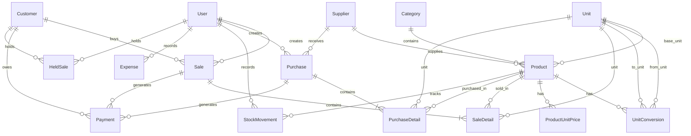

# ERD - POS Toko Plastik & Bahan Kue

## Entity Relationship Diagram

## Tabel Utama

| Tabel | Deskripsi |
|-------|-----------|
| `users` | Akun pengguna dengan role Owner/Kasir/Gudang |
| `categories` | Kategori produk (Plastik / Bahan Kue) |
| `units` | Master satuan (Pcs, Kg, Gram, Pack, Dus, Karung) |
| `products` | Data produk dengan stok dalam satuan dasar |
| `unit_conversions` | Konversi multi-satuan per produk |
| `product_unit_prices` | Harga jual per satuan |
| `customers` | Pelanggan, poin, hutang (balance) |
| `suppliers` | Pemasok barang |
| `sales` / `sale_details` | Transaksi penjualan |
| `purchases` / `purchase_details` | Transaksi pembelian |
| `stock_movements` | Riwayat mutasi stok |
| `payments` | Piutang dan hutang |
| `expenses` | Beban operasional |
| `store_settings` | Pengaturan toko |
| `held_sales` | Transaksi ditahan (hold) |

## Konversi Multi-Satuan

Contoh alur konversi **Gula**:
- 1 Karung → 50 Kg (factor: 50)
- 1 Kg → 1000 Gram (factor: 1000)

Contoh alur konversi **Cup Plastik**:
- 1 Dus → 20 Pack (factor: 20)
- 1 Pack → 50 Pcs (factor: 50)

Stok disimpan dalam **satuan dasar** produk. Saat penjualan, sistem mengkonversi otomatis ke satuan dasar.
